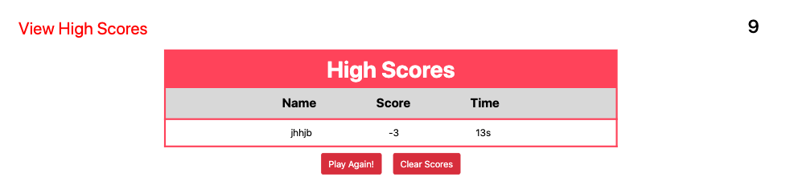

# 04 Web APIs: Code Quiz

* Functioning Website link: https://jxiong15.github.io/04-codequiz/
    * Displays an interactive quiz about coding.
* GitHub Repository Link: https://github.com/JXIong15/04-codequiz

## Functionalitty

* Start screen displays how to work the quiz. User can view the high score. User can se ehow much time they have to do the quiz.
* When the start button is clicked, the user begins the quiz.
* The quiz page will show one question with 4 buttons, each button has different answer choices.
* Once the user clicks on a choice, the page will tell them if they were correct or wrong while also displaying the next question.
* Once the timer reaches 0 or the user completes the questions in time, then the results page will show the user their score, time, and a message.
    * User will also be allowed to input their name/initials to display on the high score page.
* Once the user clicks "Submit", they are brought to an updated high scores list.

## Tasks Completed

* Created IDs in the HTML file to reference via JQuery in the JS file.
* Used the "hide" CSS to hide and display certain pages on the window.
* Used a separate JS file to contain the array of quiz questions. In the array are objects for each question, their answer, and the choices.
* Created a timer from one of the activities we did in class.
* Created buttons for each choice and compared the user answer to the correct answer.
* Created an array to store objects for the user's information: username, userScore, and userTime from the current session.

## Website Images
* Start Page: 

* Quiz: 

* Incorrect Answer on Previous Question: 

* Results Page:

* High Scores:

- - -
© 2021 Jou Xiong, Northwestern Coding Bootcamp